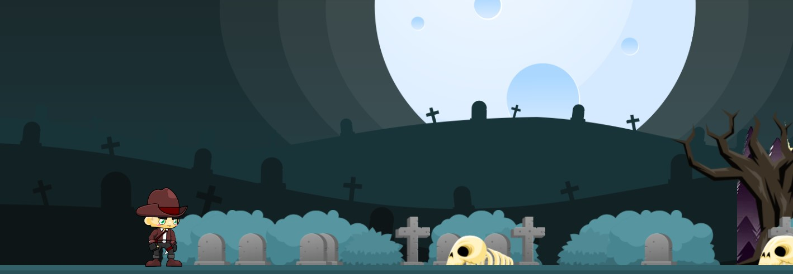

# Escape The Village

## Introduction

Escape the Village is a 2D survival game where a village man tries to escape from his hometown and make it to a city-based country. The game is set up in a series of levels, with each level offering its own set of challenges and obstacles for the player to overcome. To progress through the game, the player must solve math puzzles in order to open doors and move on to the next level.

The game is designed to encourage players to learn and practice math skills, as the puzzles become more challenging as the player progresses through the levels. This adds an educational element to the game, making it an enjoyable and engaging way for players to improve their math skills.

Each level in Escape the Village features enemies and doors that the player must navigate. When the player approaches a door, a math puzzle will appear on the screen. The player must then use their math skills to solve the puzzle and open the door, allowing them to progress to the next level.

The game has a total of six levels, each of which offers a unique set of challenges and obstacles for the player to overcome. As the player progresses through the levels, they will encounter increasingly difficult math puzzles and enemies. This keeps the gameplay fresh and engaging, as the player must constantly adapt and improve their skills in order to succeed.

Overall, Escape the Village is a unique and enjoyable game that encourages players to learn and practice math skills while also providing a thrilling survival experience. The combination of math puzzles and survival gameplay makes for a challenging and engaging experience that is sure to keep players coming back for more.

## Technology Stacks

This game was developed using **web technologies**, one advantage is that the game can be easily accessed by players through a web browser, without the need for players to download and install any additional software. It provides cross-platform compatibility meaning that the game can be played on a variety of devices such as computers, tablets, and smartphones. This makes the game more accessible to a wider audience.

### Frontend

- HTML
- CSS
- Bootstrap
- JavaScript
- jQuery

### Backend

- PHP
- MySQL

### API Services

- Smile API

### SMTP Server

- PHPMailer
- Google SMTP Server

### Others

- Python

**HTML:** Since this game was built with web technologies, HTML is unavoidable; It is used to create the structure of the game and as well as every single element in the project.

**CSS:** It is used to define the visual styles of the game's assets, such as the appearance of the enemies and other game elements, menu screens, and the entire web layout.

**Bootstrap:** It is used to develop the game's landing page and menu screens.

**JavaScript:** It is the primary programming language used to create the gameplay mechanisms and interactive elements of the game, things as the movement and behavior of the player character and enemies, as well as the logic for solving math puzzles and navigating through the levels. Additionally, it is used to implement features, such as audio and visual effects, and to interact with APIs or libraries. For example, the Smile API is accessed using JavaScript code to generate math puzzles.

**jQuery:** It is used to speed up some logical development in the game, mainly for effects like slide-up, slide-down, fade-in, and fade-out game objects.

**PHP:** Escape The Village is a collaborative game that allows multiple players to play together and compete against each other. In this case, the game includes features such as a built-in leaderboard that shows the ranking of players based on their scores and other performance metrics. The game stores player data and game progress in a database; it includes things like the player's levels, scores, and other performance metrics, as well as any additional information that is relevant to the game, such as the player's profile or settings. PHP is used to create server-side scripts that handle the communication between the game's client-side code (written in JavaScript) and the game's database and is used to make other server-side functionality for the game, such as handling user authentication and authorization.

**MySQL:** This game needs database to store all players information.

**Smile API:** Smile API is used to generate math puzzles for the game; it generates questions (Math Puzzles) as images and returns puzzle images and the correct answer; this API is used in the JavaScript when the player touches the door; JavaScript requests this API, then this API will return puzzle images and the correct answer, this api is available in the following URL: https://marcconrad.com/uob/smile/doc.php. This API belonged to the University of Bedfordshire (UOB) and was published by Marc Conrad in 2022.

**PHPMailer:** It is a library for PHP that allows developers to send email messages from a PHP application or website. It provides a simple and convenient way to send emails using PHP, this library is used for OTP number sending, and password resetting purposes.

**Google SMTP Server:** It is a service provided by Google that allows users to send email messages using the Simple Mail Transfer Protocol (SMTP). SMTP is a standard protocol for sending email messages used by most email servers and clients.

**Python:** It is used to generate html codes to make game objects, enemies, coins, diamonds in random locations in all levels.

## Setup

**Note:** To setup this project in production, PHP, MySQL, Google SMTP Server and web server is needed.

### Folder Structure

    ├── 0-database                  # Contains the MySQL Database.
    ├── 1-landing-page-source       # Contains the landing website source (Register / Login).
    ├── 2-game-source               # Contains the the game source (Game Screens / Game).
    ├── 3-others                    # Contains other research works and, Python scripts.
    ├── github-readme-content       # Contains readme contents.
    ├── LICENSE						# Contains Apache License 2.0
    └── README.md					# Contains Readme Documentations
    └──.gitignore					# Contains gitignore information
